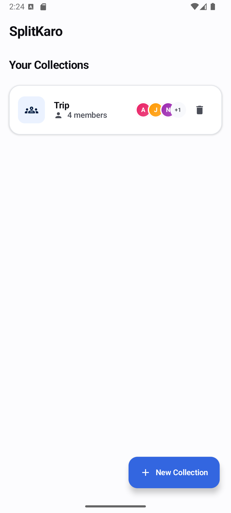
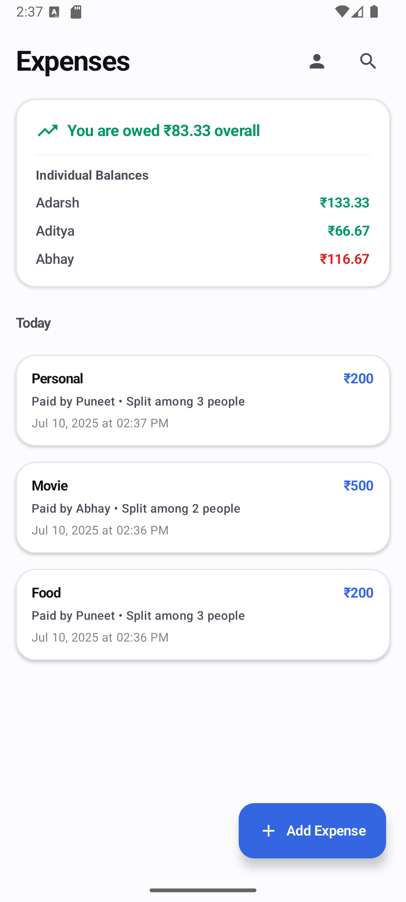
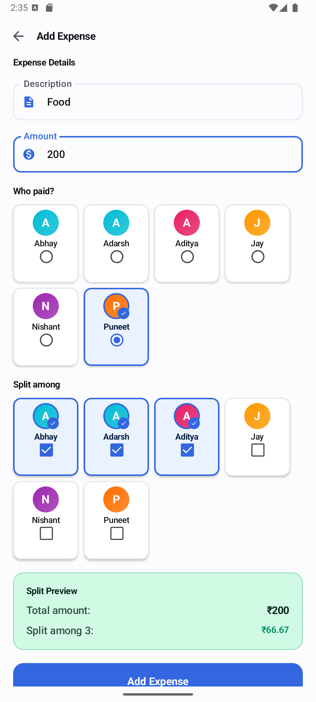
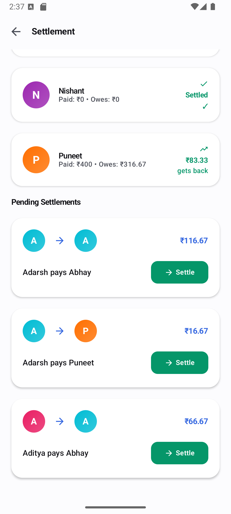

# SplitKaro

<div align="center">
  
</div>

**SplitKaro** is an Android application designed to simplify group expense tracking and settlement. Whether you're splitting bills with friends, roommates, or colleagues, SplitKaro helps you manage shared expenses effortlessly, calculate individual balances, and facilitate settlements. Built with modern Android development practices, it ensures a seamless and intuitive user experience.

## Table of Contents
- [Features](#features)
- [Screenshots](#screenshots)
- [Installation](#installation)
- [Usage](#usage)
- [Technologies Used](#technologies-used)
- [Contributing](#contributing)
- [License](#license)
- [Contact](#contact)

## Features
- **Expense Tracking**: Create and manage expense collections for different groups or events.
- **Member Management**: Add, remove, and manage members within each expense collection.
- **Split Calculations**: Automatically calculate per-person amounts and track who paid for what.
- **Settlement System**: Generate settlement records to simplify debt resolution among group members.
- **User-Centric Balances**: View personalized balance summaries to see who owes you or whom you owe.
- **Reactive UI**: Real-time updates using Kotlin Flow and Jetpack Compose for a responsive interface.
- **Onboarding**: Seamless user onboarding with persistent user preferences.
- **Error Handling**: Robust validation and error messaging for a smooth user experience.

## Screenshots
<div style="display: flex; justify-content: center; gap: 10px;">
  
  
  
  
</div>

## Installation

### Prerequisites
- **Android Studio**: Latest version (recommended: Android Studio Koala or later)
- **JDK**: 17 or higher
- **Android SDK**: API level 31 or higher
- **Git**: To clone the repository

### Steps
1. **Clone the Repository**:
   ```bash
   git clone https://github.com/yourusername/splitkaro.git
   ```
2. **Open in Android Studio**:
   - Launch Android Studio.
   - Select **Open an existing project**.
   - Navigate to the cloned `splitkaro` directory and select it.
3. **Sync Project**:
   - Click **Sync Project with Gradle Files** in Android Studio to download dependencies.
4. **Build and Run**:
   - Connect an Android device or configure an emulator.
   - Click **Run** to build and install the app.

### Dependencies
The project uses Gradle for dependency management. Key dependencies are defined in `build.gradle`:
- **Jetpack Compose**: For modern UI development.
- **Room**: For local database persistence.
- **Hilt**: For dependency injection.
- **Kotlin Coroutines & Flow**: For asynchronous operations and reactive data streams.

## Usage
1. **Onboarding**:
   - On first launch, enter your name to set up your user profile.
2. **Create a Collection**:
   - Navigate to the Expense Collection screen and create a new group (e.g., "Trip to Goa").
   - Add members to the collection.
3. **Add Expenses**:
   - Select a collection and add expenses, specifying the amount, description, who paid, and how it's split.
4. **View Balances**:
   - Check individual balances and overall group summary on the Home screen.
5. **Settle Up**:
   - Use the Settlement screen to view and mark settlements as completed, automatically recording them as expenses.
6. **Manage Members**:
   - Add or remove members from collections as needed.

## Technologies Used
- **Language**: Kotlin
- **UI Framework**: Jetpack Compose
- **Database**: Room Persistence Library
- **Dependency Injection**: Hilt
- **Asynchronous Programming**: Kotlin Coroutines, Flow
- **Navigation**: Jetpack Navigation Compose
- **Architecture**: MVVM (Model-View-ViewModel)
- **Build Tool**: Gradle

## Contributing
Contributions are welcome! To contribute:
1. Fork the repository.
2. Create a feature branch:
   ```bash
   git checkout -b feature/YourFeature
   ```
3. Commit your changes:
   ```bash
   git commit -m 'Add YourFeature'
   ```
4. Push to the branch:
   ```bash
   git push origin feature/YourFeature
   ```
5. Open a Pull Request.

Please ensure your code follows the project's coding standards and includes relevant tests.

## License
This project is licensed under the MIT License. See the [LICENSE](LICENSE) file for details.

---
Happy expense splitting with SplitKaro! 💸
